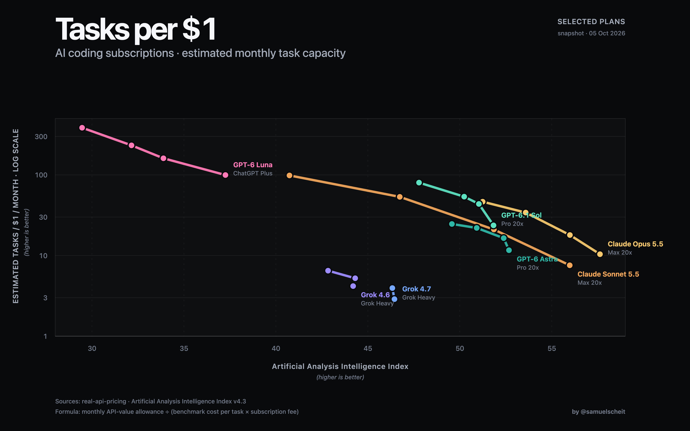

# AI Coding Subscription Task-Value Benchmark

[](https://htmlpreview.github.io/?https://github.com/samuelscheit/ai-subscription-comparison/blob/main/charts/high_value_subscriptions_tasks_per_dollar.html)

A quantitative framework comparing high-value AI coding subscriptions by **tasks completed per dollar per month**, rather than raw tokens or provider-selected API-equivalent retail value.

## Current comparison scope

The benchmark table includes flagship/high-value plans plus one directly measured GPT-6 Luna row:

- Anthropic: Claude Max 20x and Claude Max 5x
- OpenAI: ChatGPT Pro 20x and ChatGPT Pro 5x
- OpenAI: ChatGPT Plus / GPT-6 Luna (direct measurement; no Pro extrapolation)
- xAI: SuperGrok Heavy and SuperGrok Plus

Low reasoning levels (`low`), lightweight models, OpenCode/Command Code wrappers, and Muse/Meta plans are excluded from the current chart.

The social graph selects one canonical flagship plan per model plus the measured ChatGPT Plus / GPT-6 Luna row for a clean seven-curve comparison. Points are reasoning effort levels (`med`, `high`, `xhigh`, `max`). The y-axis uses a logarithmic scale so the full value range remains readable:

$$\text{Tasks per Dollar} = \frac{\text{Monthly API-value allowance}}{\text{AA cost per task} \times \text{monthly subscription fee}}$$

## Local data snapshot

All source data is committed locally under `data/` and `derived/`

- Source snapshot metadata: `data/SOURCE_METADATA.json`
- Subscription quota evidence: `data/`
- Derived plan/model points and benchmark joins: `derived/`
- Upstream source: [FeiZhuLulu/real-api-pricing](https://github.com/FeiZhuLulu/real-api-pricing)
- Intelligence Index source: [Artificial Analysis](https://artificialanalysis.ai/)

## Generated artifacts

- `charts/high_value_subscriptions_tasks_per_dollar.html`: Offline-capable dark web chart with hover details and PNG export.
- `charts/high_value_subscriptions_tasks_per_dollar.png`: 4800×3000 (3×, 8:5) social image rendered from the web chart.
- `charts/subscriptions_task_value_benchmark.csv`: Filtered high-value plan/model/reasoning table.
- `charts/subscriptions_task_value_benchmark.json`: Same table in JSON format.

The chart uses one canonical flagship plan per model plus GPT-6 Luna's direct ChatGPT Plus measurement to keep the social composition legible; the full 29-row export remains in the CSV/JSON files. GPT-6 Luna is not extrapolated to Pro because the local source explicitly declines that derivation. Claude Haiku 4.5 remains out of the benchmark until the local snapshot includes both its subscription allowance and matched task-cost/score rows; an incidental session observation alone is not enough to derive tasks per dollar.

## Rebuild

```bash
python3 run_benchmark.py
```

`run_benchmark.py` refreshes the table exports and embedded chart data. The checked-in PNG is the last high-resolution browser render of that HTML source.
